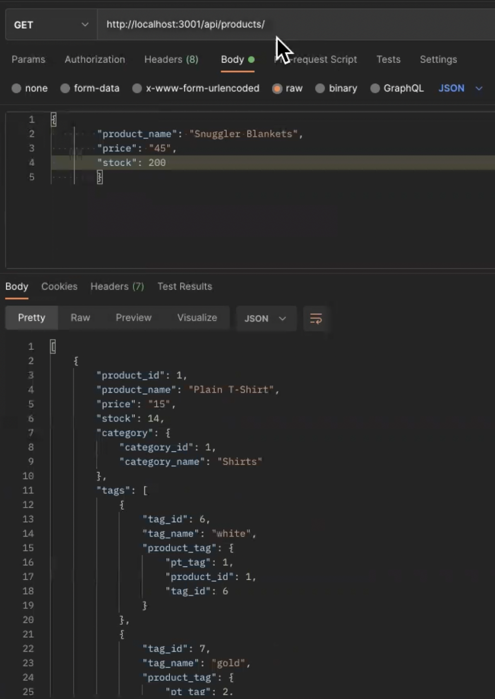
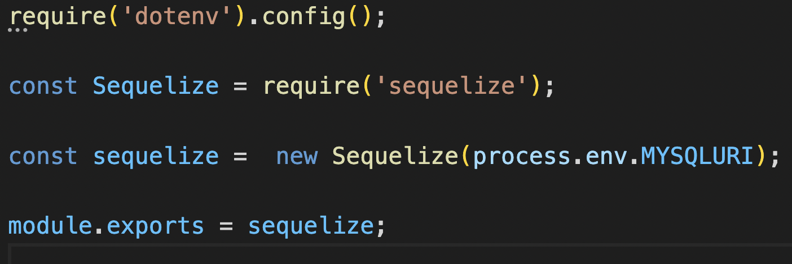
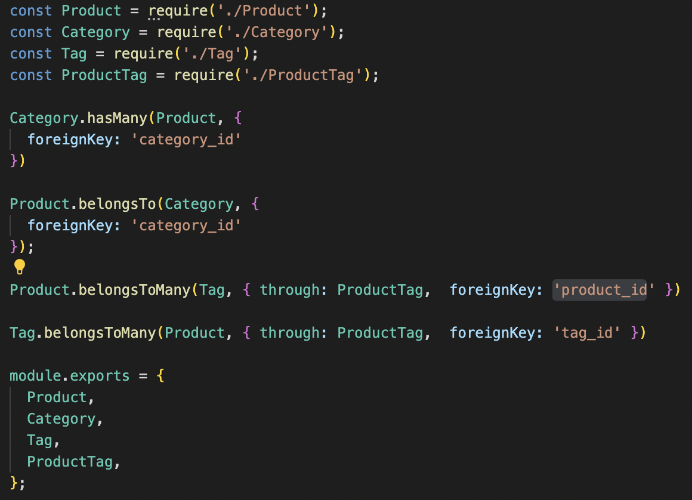
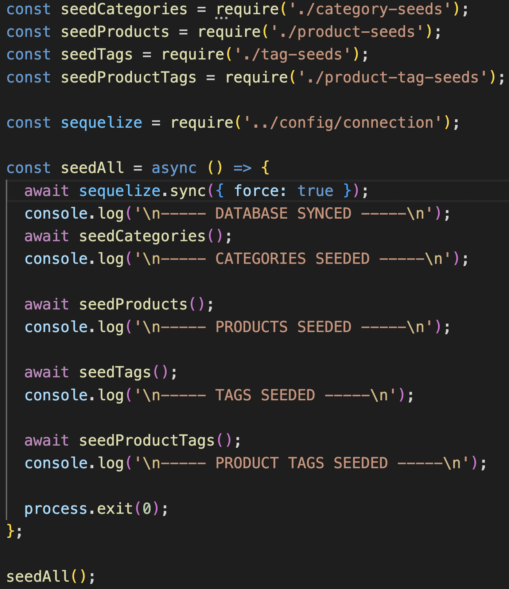
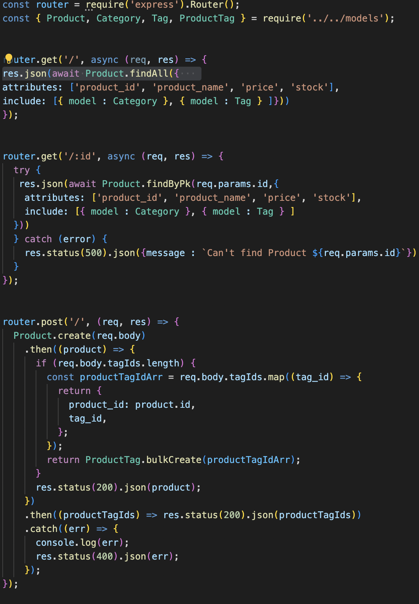
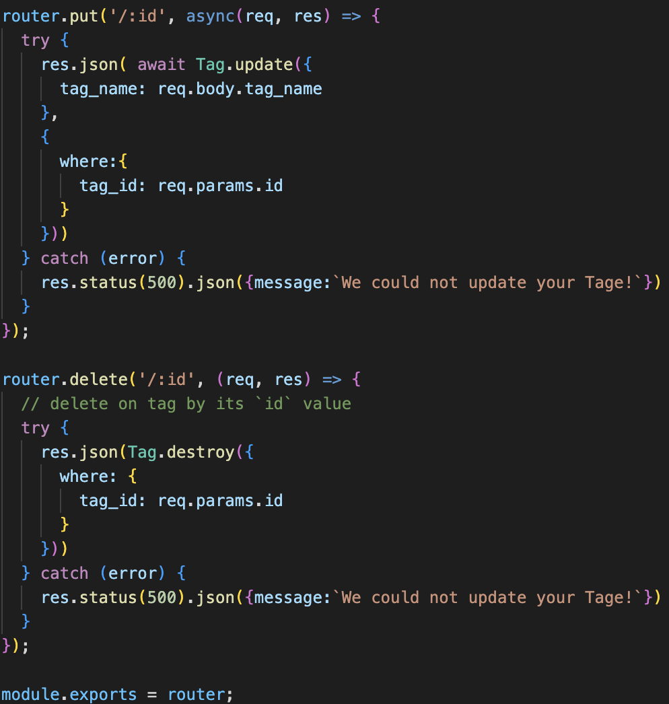

# Back Of Shop 
   

# VIDEO Walk Through:

  ## Description
  In this app I made all of the back-end. I made a schema that was compatible with the seeds provided. I have all of the routes connected and the sequelize connecting with mysql database. 

  ## Table of Contents 
  - [Installation](#installation)
  - [Usage](#usage)

  ## Installation
  Download the files. You may need to adjust the URI to fit your sequilze. 

  ## Usage
  Once you have all the files downloaded, make sure to download the dependencies. After that run the app in your CLI. Open up your favorite CRUD tester and have fun!

  ## Questions
  Here is my email for questions:  jimmysolis14@gmail.com
   
  If you would like to look me up in github, here is my username: JimmySolis
   
  Follow these instructions to contact me:  
  Please email me if you have any questions.

  ## Links
  Github repo:
  https://github.com/JimmySolis/BackOfShop

  Video link: 
  https://drive.google.com/file/d/1Z2m7rBbEFWyvxE-YDtwUo_A7CjKm5vwS/view?usp=sharing

  # How it work:

  ## 1: We make sure we have a connection that is suppling our sensitive credentials through a .env file
  

  ## 2: Once I have made the needed schema, I make use of the index.js to connect my models.
  

  ## 3: When the routes work I seed them.
  

  ## 4: Here are some of the api routes and how they work.
  

  ## 5: Here are some more of the routes these are to update and delete
   

  ## 6: Finally our server to make the app run!
  

  